# 🏠 Real Estate Blockchain + MAS 2025 - Malaysian Auction Property Market

[](https://opensource.org/licenses/MIT)
[](https://nodejs.org/)
[](https://reactjs.org/)
[](https://www.typescriptlang.org/)

## 🎯 2025 Malaysian Auction Property Market Focus

Comprehensive blockchain-powered platform with AI Multi-Agent System specifically designed for Malaysian property auctions, featuring full regulatory compliance, bilingual support, and mobile-first design.

## 🏛️ 2025 Regulatory Compliance

### ✅ Government Integration
- **e-Tanah**: Digital land title verification and transfer
- **JPPH**: Real-time property valuation
- **e-Lelong**: Public auction listings integration
- **BNM**: AML/KYC compliance for high-value transactions
- **LHDN**: Automated RPGT calculation and submission

### ✅ Legal Framework
- **Digital Signature Act 1997**: e-Consent and digital S&P
- **ECA 2006**: Electronic document legality
- **2025 RPGT Updates**: Auction property tax exemptions
- **Strata Title Act**: Condominium auction compliance

## 🤖 AI-Powered Multi-Agent System

### Core Agents
- **🏛️ AuctioneerAgent**: Manages auction processes and compliance
- **👤 BidderAgent**: Represents individual bidders with AI behavior
- **⚖️ ComplianceAgent**: Monitors regulatory adherence
- **💰 ValuationAgent**: Provides real-time market analysis
- **🔍 FraudDetectionAgent**: Identifies suspicious patterns

### AI Capabilities
- Bahasa Melayu negotiation dialogs
- Predictive bidding behavior simulation
- Real-time fraud pattern detection
- Market trend analysis and recommendations

## 📱 Mobile-First Bilingual Interface

### Languages
- **🇲🇾 Bahasa Melayu** (Primary)
- **🇬🇧 English** (Secondary)

### Mobile Features
- Live auction bidding dashboard
- Agent on-site tools for auction centers
- Optimized for rural/urban connectivity
- Offline capability for remote areas

## 💳 Malaysian Payment Integration

### Supported Methods
- **DuitNow QR**: Instant QR code payments
- **FPX**: Online banking integration
- **Maybank2u**: Direct bank integration
- **CIMB Clicks**: Secure online banking
- **Smart Contract Escrow**: Automated deposit handling

## 🏘️ Specialized Property Types

### Supported Categories
- **Tanah Rizab Melayu**: Malay reserve land auctions
- **Rumah Mampu Milik**: Affordable housing programs
- **Lelong Properties**: Traditional auction properties
- **Distressed Assets**: Bank and corporate auctions

### Regional Coverage
- **Selangor**: e-Lelong integration
- **Johor**: PTG auction workflows
- **Penang**: Hybrid bidding systems
- **Kuala Lumpur**: High-value property auctions

### Real Estate Blockchain + MAS 2025 Workflows

```mermaid
flowchart TD

    subgraph UI["Frontend Interfaces"]
        MobileApp["📱 Mobile App\n(React Native)"]
        WebPortal["💻 Web Portal\n(React)"]
        AdminPanel["🛠️ Admin Panel\n(React)"]
    end

    subgraph Gateway["🌐 API Gateway\n(Express.js)"]
    end

    subgraph MAS["🤖 Multi-Agent System"]
        Auctioneer["🏛️ AuctioneerAgent"]
        Bidder["👤 BidderAgent"]
        Compliance["⚖️ ComplianceAgent"]
        Valuation["💰 ValuationAgent"]
        Fraud["🔍 FraudDetectionAgent"]
    end

    subgraph Chain["⛓️ Blockchain Integration"]
        Contract["📝 Smart Contract"]
        Web3["🌐 Web3 Provider"]
        Logs["📜 Event Logs"]
        Token["🔐 Token Management"]
    end

    subgraph Gov["🏛️ Government API Integrations"]
        eTanah["📄 e-Tanah"]
        JPPH["📊 JPPH"]
        BNM["🏦 BNM"]
        LHDN["💸 LHDN"]
        eLelong["📣 e-Lelong"]
    end

    UI --> Gateway
    Gateway --> MAS
    Gateway --> Chain
    Gateway --> Gov

    subgraph Dev["🧪 Developer Workflow"]
        Clone["📥 Clone Repo"]
        Install["📦 Install Dependencies"]
        DevEnv["🧩 Start Dev Environment"]
        Agents["🤖 Start MAS"]
        Contracts["📝 Deploy Contracts"]
        BuildTest["🛠️ Build & Test"]
    end

    Dev --> Clone --> Install --> DevEnv --> Gateway
    DevEnv --> Agents
    DevEnv --> Contracts
    Dev --> BuildTest

    subgraph Legal["⚖️ Regulatory Framework"]
        DSA["🖋️ Digital Signature Act"]
        ECA["📑 Electronic Commerce Act"]
        RPGT["📄 RPGT 2025"]
        Strata["🏢 Strata Titles Act"]
    end

    Legal --> Compliance
    Legal --> Gov

    subgraph Payment["💳 Payment Integration"]
        DuitNow["📲 DuitNow QR"]
        FPX["🏦 FPX"]
        Maybank["💰 Maybank2u"]
        CIMB["💳 CIMB Clicks"]
        Escrow["🔐 Smart Contract Escrow"]
    end

    Payment --> Chain
    WebPortal --> Payment
    MobileApp --> Payment

    classDef system fill:#f9f,stroke:#333,stroke-width:2px;
    class MobileApp,WebPortal,AdminPanel,Gov,MAS,Chain,Payment system;
```




## 🚀 Quick Start

### Prerequisites
- Node.js >= 18.0.0
- npm >= 8.0.0
- MongoDB (for local development)
- MetaMask or compatible Web3 wallet

### Installation
```bash
# Clone repository
git clone https://github.com/your-org/real-estate-blockchain-mas-2025.git
cd real-estate-blockchain-mas-2025

# Install all dependencies
npm run install-all

# Start development environment
npm run dev
```

### Environment Setup
```bash
# Backend environment variables
cp backend/.env.example backend/.env

# Configure API keys
MONGODB_URI=mongodb://localhost:27017/realestate2025
JWT_SECRET=your-jwt-secret
E_TANAH_API_KEY=your-etanah-key
JPPH_API_KEY=your-jpph-key
BNM_API_KEY=your-bnm-key
LHDN_API_KEY=your-lhdn-key
```

## 📊 System Architecture

```mermaid
flowchart TB
    %% Frontend Applications
    MobileApp["Mobile App<br/>(React Native)"]
    WebPortal["Web Portal<br/>(React)"]
    AdminPanel["Admin Panel<br/>(React)"]

    %% Connecting to API Gateway
    MobileApp --> APIGateway
    WebPortal --> APIGateway
    AdminPanel --> APIGateway

    %% API Gateway
    APIGateway["API Gateway<br/>(Express.js)"]

    %% Backend Systems
    MultiAgent["Multi-Agent System<br/>• AuctioneerAgent<br/>• BidderAgent<br/>• ComplianceAgent<br/>• ValuationAgent<br/>• FraudDetection"]
    Blockchain["Blockchain Integration<br/>• Smart Contract<br/>• Web3 Provider<br/>• Event Logs<br/>• Token Mgmt"]
    GovAPIs["Gov APIs Integration<br/>• e-Tanah<br/>• JPPH<br/>• BNM<br/>• LHDN<br/>• e-Lelong"]

    APIGateway --> MultiAgent
    APIGateway --> Blockchain
    APIGateway --> GovAPIs
```



## 🔧 Development Commands

```bash
# Development
npm run dev                 # Start frontend + backend
npm run frontend           # Frontend only
npm run backend           # Backend only

# Building
npm run build-all         # Build all components
npm run test-all          # Run all tests

# Blockchain
npm run deploy-contracts  # Deploy smart contracts
npm run start-agents     # Start multi-agent system
```

## 📚 Documentation

- [📖 API Documentation](./docs/api/)
- [🤖 Agent System Guide](./docs/agents/)
- [⚖️ Compliance Manual](./docs/compliance/)
- [📱 Mobile App Guide](./docs/mobile/)
- [📋 Case Studies](./docs/case-studies/)

## 🎯 Case Studies

### Real-World Implementations
1. **[Selangor e-Lelong Integration](./docs/case-studies/selangor-e-lelong.md)**
   - Live auction with smart contracts
   - 90% reduction in processing time
   - 100% compliance score

2. **[Johor PTG Auction Workflow](./docs/case-studies/johor-ptg.md)**
   - Multi-agent assisted bidding
   - Automated title transfer
   - Bilingual interface adoption

3. **[Penang Hybrid Property Bidding](./docs/case-studies/penang-hybrid.md)**
   - Online + physical auction integration
   - Mobile-first bidder experience
   - Real-time fraud detection

## 🤝 Contributing

We welcome contributions from Malaysian developers, government agencies, and PropTech companies.

### Getting Started
1. Read [CONTRIBUTING.md](./CONTRIBUTING.md)
2. Check [open issues](https://github.com/your-org/real-estate-blockchain-mas-2025/issues)
3. Fork the repository
4. Create feature branch
5. Submit pull request

### Development Guidelines
- Follow Malaysian regulatory requirements
- Maintain bilingual support (BM/EN)
- Ensure mobile-first design
- Include comprehensive tests
- Document API changes

## 📄 License

This project is licensed under the MIT License - see the [LICENSE](LICENSE) file for details.

## 🏢 Partners & Acknowledgments

- **Malaysian Government Digital Services**
- **Bank Negara Malaysia (BNM)**
- **Lembaga Hasil Dalam Negeri (LHDN)**
- **Jabatan Penilaian dan Perkhidmatan Harta (JPPH)**
- **Real Estate & Housing Developers Association Malaysia (REHDA)**
- **Blockchain Malaysia Association**

## 📞 Support

- **Email**: support@realestate-xxxxxxxxxx-xxx.xx
- **Telegram**: @RealEstateBlockchainMY
- **Documentation**: [docs.realestate-xxxxxxxxxx-xxx.xx](https://docs.realestate-xxxxxxx.xxx.xx)
- **Issues**: [GitHub Issues](https://github.com/your-org/real-estate-blockchain-mas-2025/issues)

---

**🇲🇾 Built for Malaysia's Digital Property Future 🇲🇾**
