# Malaysian Real Estate Platform - 2025 Market Updates

## Overview
This document outlines the comprehensive updates made to the Malaysian Real Estate Platform to ensure full compliance and optimization for the 2025 Malaysian property market.

## 🚀 Key Features Added

### 1. Enhanced Property Model
- **Malaysian-specific fields**: Land title types, Mukim, District, State
- **RPGT integration**: Real Property Gains Tax calculation and tracking
- **Stamp duty compliance**: E-stamping integration with government systems
- **Rizab Melayu support**: Special handling for Malay Reserve properties
- **Rumah Mampu Milik**: Affordable housing program integration
- **Auction properties**: Complete auction workflow support

### 2. Government API Integration
- **JPPH Integration**: Property valuation through Jabatan Penilaian dan Perkhidmatan Harta
- **e-Tanah Integration**: Land title search and verification
- **e-Consent System**: Property transfer consent automation
- **e-Stamp Integration**: Digital stamp duty calculation and payment
- **LHDN RPGT**: Real Property Gains Tax calculation and submission
- **BNM Compliance**: Bank Negara Malaysia AML/KYC verification

### 3. Enhanced Blockchain Services
- **2025 RPGT Rates**: Updated tax calculation with current exemptions
- **E-stamping Integration**: Digital stamp duty processing
- **DuitNow Support**: QR code and transfer payment methods
- **FPX Integration**: Online banking payment gateway
- **Malaysian Bank Integration**: Support for local banks (CIMB, Maybank, etc.)
- **LTV Calculation**: Loan-to-Value ratio compliance with BNM guidelines

### 4. AI-Enhanced Agent System
- **Bilingual Negotiation**: AI-generated scripts in English and Bahasa Melayu
- **Fraud Detection**: Malaysian market-specific risk assessment
- **Property Valuation**: ML-based valuation with JPPH integration
- **Market Analysis**: Regional trend analysis for Malaysian states
- **Buyer Behavior Prediction**: AI-powered buyer intent analysis
- **Auction Analysis**: Specialized auction property evaluation

### 5. Bilingual Frontend Support
- **Language Context**: React context for English/Bahasa Melayu switching
- **Comprehensive Translations**: Property, legal, and financial terminology
- **Malaysian UI Components**: State/district/mukim selectors
- **Currency Formatting**: Malaysian Ringgit (MYR) formatting
- **Cultural Adaptation**: UI elements adapted for Malaysian users

## 📁 File Structure Updates

### Backend

```mermaid
flowchart TD
    backend["📁 backend/"]
    backend --> src["📁 src/"]

    src --> types["📁 types/"]
    types --> malaysianTypes["📄 malaysianProperty.ts"]

    src --> models["📁 models/"]
    models --> propertyModel["📄 Property.ts"]

    src --> services["📁 services/"]
    services --> blockchain["📄 blockchain.ts"]
    services --> agentSystem["📄 agentSystem.ts"]
    services --> malaysianGovAPI["📄 malaysianGovAPI.ts"]
```


### Frontend

```mermaid
flowchart TD
    src["📁 src/"]

    src --> i18n["📁 i18n/"]
    i18n --> translations["📄 translations.ts"]

    src --> contexts["📁 contexts/"]
    contexts --> languageContext["📄 LanguageContext.tsx"]

    src --> components["📁 components/"]
    components --> languageSwitcher["📁 LanguageSwitcher/"]
    components --> propertySearch["📁 PropertySearch/"]
    components --> layout["📁 layout/"]
    layout --> navbar["📄 Navbar.tsx"]
```


## 🏛️ Government Compliance Features


### RPGT (Real Property Gains Tax)
- **2025 Tax Rates**: Updated citizen/non-citizen/company rates
- **Holding Period Calculation**: Automatic exemption determination
- **Primary Residence Exemption**: Citizen exemption handling
- **Automated Calculation**: Integration with LHDN systems

### Stamp Duty
- **Progressive Rates**: 2025 Malaysian stamp duty structure
- **E-stamping Integration**: Digital stamp duty processing
- **Exemption Handling**: First-time buyer and other exemptions
- **Real-time Calculation**: Instant duty computation

### Land Title Management
- **Geran Support**: Full freehold title handling
- **Hakmilik Sementara**: Temporary title management
- **Pajakan**: Leasehold property support
- **Rizab Melayu**: Malay Reserve land compliance


## 💰 Payment Integration


### DuitNow
- **QR Code Payments**: Generate and process QR payments
- **Bank Transfer**: Direct account-to-account transfers
- **Real-time Processing**: Instant payment confirmation

### FPX (Financial Process Exchange)
- **Bank Selection**: Support for all Malaysian banks
- **Secure Redirect**: Encrypted payment processing
- **Transaction Tracking**: Complete audit trail

### Malaysian Banks
- **CIMB Integration**: Direct API integration
- **Maybank Support**: Comprehensive banking services
- **Public Bank**: Payment and loan processing
- **Hong Leong Bank**: Full service integration

## 🤖 AI Features

### Negotiation Assistant
- **Bilingual Scripts**: English and Bahasa Melayu negotiation templates
- **Cultural Adaptation**: Malaysian business etiquette integration
- **Market-based Pricing**: AI-powered price recommendations

### Fraud Detection
- **Price Anomaly Detection**: JPPH valuation comparison
- **Title Verification**: e-Tanah integration for title checks
- **Transaction Pattern Analysis**: Suspicious activity identification
- **AML Compliance**: Bank Negara Malaysia requirements

### Market Intelligence
- **Regional Analysis**: State-by-state market trends
- **Infrastructure Impact**: Development project correlation
- **Demand Prediction**: AI-powered market forecasting

## 🌐 Internationalization

### Language Support
- **English**: Complete interface translation
- **Bahasa Melayu**: Full Malaysian language support
- **Dynamic Switching**: Real-time language changes
- **Cultural Adaptation**: Malaysian-specific terminology

### Currency & Formatting
- **Malaysian Ringgit (MYR)**: Proper currency formatting
- **Number Formatting**: Malaysian locale support
- **Date Formatting**: Local date conventions

## 🔧 Technical Implementation

### Property Model Enhancements
```typescript
interface IProperty {
  // Malaysian-specific fields
  landTitleType: LandTitleType;
  landTitleNumber: string;
  location: MalaysianLocation;
  isRizabMelayu: boolean;
  isRumahMampuMilik: boolean;
  
  // Financial compliance
  rpgtDetails: RPGTDetails;
  stampDutyDetails: StampDutyDetails;
  valuation: PropertyValuation;
  
  // Government references
  jpphPropertyId: string;
  eTanahReference: string;
  eConsentReference: string;
}
```

### Government API Integration
```typescript
class MalaysianGovAPIService {
  async getJPPHValuation(propertyId: string): Promise<JPPHValuationResponse>;
  async searchETanahTitle(titleNumber: string): Promise<ETanahTitleResponse>;
  async calculateStampDuty(propertyValue: number): Promise<EStampResponse>;
  async calculateRPGT(details: RPGTDetails): Promise<LHDNRPGTResponse>;
  async verifyBNMCompliance(userIC: string): Promise<ComplianceResponse>;
}
```

## 📊 Performance Optimizations

### Database Indexing
- **Location-based indexes**: State, district, mukim optimization
- **Price range indexes**: Efficient property search
- **Title type indexes**: Fast filtering by land title
- **Status indexes**: Quick availability filtering

### Caching Strategy
- **JPPH Valuations**: Cache government API responses
- **Exchange Rates**: Real-time currency conversion
- **Market Data**: Regional trend caching

## 🔒 Security Enhancements

### Data Protection
- **IC Number Encryption**: Malaysian identity card protection
- **Bank Account Security**: Encrypted financial data
- **Government API Security**: Secure token management

### Compliance
- **PDPA Compliance**: Personal Data Protection Act adherence
- **BNM Guidelines**: Central bank requirement compliance
- **AML/CFT**: Anti-money laundering measures

## 🚀 Deployment Considerations

### Environment Variables
```env
# Government API Keys
JPPH_API_KEY=your_jpph_api_key
ETANAH_API_KEY=your_etanah_api_key
LHDN_API_KEY=your_lhdn_api_key

# Payment Gateways
DUITNOW_MERCHANT_ID=your_merchant_id
FPX_MERCHANT_CODE=your_fpx_code

# Blockchain
ETHEREUM_NETWORK=mainnet
SMART_CONTRACT_ADDRESS=0x...
```

### Production Setup
1. **SSL Certificates**: Required for government API integration
2. **Domain Verification**: .my domain recommended
3. **Server Location**: Malaysian data center preferred
4. **Backup Strategy**: Cross-region backup for compliance

## 📈 Future Roadmap

### Q1 2025
- [ ] Integration with more state land offices
- [ ] Enhanced mobile app features
- [ ] IoT property monitoring integration

### Q2 2025
- [ ] AI-powered property recommendation engine
- [ ] Blockchain-based property ownership certificates
- [ ] Integration with Malaysian property portals

### Q3 2025
- [ ] Virtual property tours with VR
- [ ] Smart contract automation for S&P agreements
- [ ] Integration with Malaysian banks' digital platforms

## 🤝 Contributing

### Development Guidelines
1. **Code Standards**: Follow Malaysian government API guidelines
2. **Testing**: Include unit tests for all Malaysian-specific features
3. **Documentation**: Maintain bilingual documentation
4. **Compliance**: Ensure all features meet local regulations

### Reporting Issues
- Use GitHub issues for bug reports
- Include Malaysian context for property-related issues
- Provide both English and Bahasa Melayu error descriptions

## 📞 Support

For technical support or questions about Malaysian property regulations:
- Email: support@realestate-malaysia.com
- Phone: +60 3-XXXX XXXX
- Documentation: https://docs.realestate-malaysia.com

---

**Last Updated**: December 2024
**Version**: 2025.1.0
**Compliance**: Malaysian Property Market 2025
