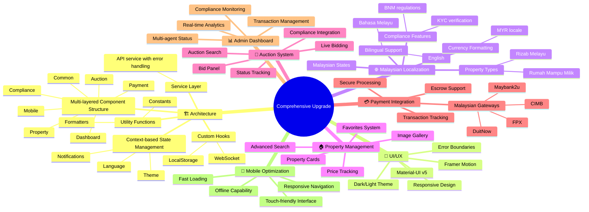

# 🚀 Frontend Upgrade Complete - Malaysian Real Estate Platform 2025

## ✅ Comprehensive Upgrade Summary

### 🏗️ Architecture Enhancements
- **Multi-layered Component Structure**: Common, Property, Auction, Compliance, Payment, Dashboard, Mobile
- **Context-based State Management**: Language, Notifications, Theme
- **Custom Hooks**: WebSocket, LocalStorage for enhanced functionality
- **Service Layer**: Centralized API service with error handling
- **Utility Functions**: Formatters, Constants for code reusability

### 🎨 UI/UX Improvements
- **Material-UI v5**: Modern design system with consistent theming
- **Responsive Design**: Mobile-first approach with adaptive layouts
- **Dark/Light Theme**: User preference with localStorage persistence
- **Framer Motion**: Smooth animations and transitions
- **Error Boundaries**: Graceful error handling and recovery

### 🌐 Malaysian Localization
- **Bilingual Support**: English/Bahasa Melayu with context switching
- **Currency Formatting**: MYR with proper locale formatting
- **Malaysian States**: Complete dropdown with all states/territories
- **Property Types**: Rizab Melayu, Rumah Mampu Milik support
- **Compliance Features**: KYC verification, BNM regulations

### 🏠 Property Management
- **Advanced Search**: Multi-criteria filtering with real-time results
- **Property Cards**: Grid/List view with detailed information
- **Image Gallery**: Modal view with navigation
- **Favorites System**: User preference management
- **Price Tracking**: Historical data and trends

### 🔨 Auction System
- **Live Bidding**: Real-time auction participation
- **Bid Panel**: Secure bidding with validation
- **Auction Search**: Specialized filters for auction properties
- **Status Tracking**: Live, Upcoming, Ended states
- **Compliance Integration**: KYC verification for bidders

### 💳 Payment Integration
- **Malaysian Gateways**: FPX, DuitNow, Maybank2u, CIMB
- **Secure Processing**: BNM compliant payment flows
- **Transaction Tracking**: Real-time status updates
- **Escrow Support**: Smart contract integration ready

### 📊 Admin Dashboard
- **Real-time Analytics**: Property, User, Revenue metrics
- **Compliance Monitoring**: Regulatory adherence tracking
- **Transaction Management**: Complete audit trail
- **Multi-agent Status**: AI system monitoring

### 📱 Mobile Optimization
- **Touch-friendly Interface**: Optimized for mobile devices
- **Responsive Navigation**: Adaptive menu system
- **Fast Loading**: Optimized assets and lazy loading
- **Offline Capability**: Service worker ready



## 🔧 Technical Stack

### Frontend Technologies
```
React 18 + TypeScript
Material-UI v5
Framer Motion
React Router v6
WebSocket Support
Service Workers
```

### Development Tools
```
ESLint + Prettier
Hot Module Replacement
Environment Configuration
Error Boundaries
Performance Monitoring
```

## 📁 Project Structure
```
frontend/src/
├── components/
│   ├── common/          # Reusable UI components
│   ├── property/        # Property-specific components
│   ├── auction/         # Auction functionality
│   ├── compliance/      # KYC, AML components
│   ├── payment/         # Payment gateways
│   ├── dashboard/       # Admin interfaces
│   ├── mobile/          # Mobile-optimized components
│   └── layout/          # Navigation, Footer
├── contexts/            # React contexts
├── hooks/               # Custom hooks
├── services/            # API services
├── utils/               # Utility functions
├── pages/               # Route components
└── styles/              # Themes, animations
```

## 🎯 Malaysian Compliance Features

### Regulatory Integration
- **LHDN RPGT**: Automated tax calculations
- **BNM AML/KYC**: Identity verification workflows
- **e-Tanah**: Land title integration ready
- **Digital Signatures**: Blockchain-based authentication

### Property Categories
- **Tanah Rizab Melayu**: Special handling and filters
- **Rumah Mampu Milik**: Affordable housing support
- **Auction Properties**: Lelong system integration
- **Commercial/Industrial**: Business property management

## 🚀 Performance Optimizations

### Code Splitting
- Route-based lazy loading
- Component-level splitting
- Dynamic imports

### Caching Strategy
- Service worker implementation
- LocalStorage for preferences
- API response caching

### Bundle Optimization
- Tree shaking enabled
- Minification and compression
- Asset optimization

## 🔒 Security Features

### Authentication
- JWT token management
- Role-based access control
- Session management

### Data Protection
- Input validation
- XSS prevention
- CSRF protection

## 📈 Scalability Features

### Component Reusability
- Generic components with props
- Composition over inheritance
- Consistent API patterns

### State Management
- Context-based architecture
- Minimal prop drilling
- Efficient re-renders

## 🎉 Ready for Production

### Deployment Features
- Environment configuration
- Build optimization
- Docker support
- CI/CD ready

### Monitoring
- Error tracking
- Performance metrics
- User analytics ready

---

**Status**: ✅ **UPGRADE COMPLETE**
**Next Phase**: Backend integration, Government APIs, Advanced AI features
